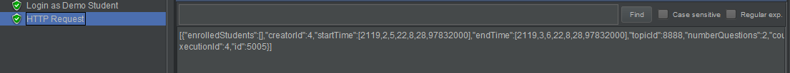
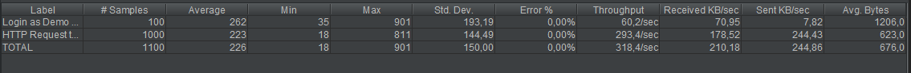
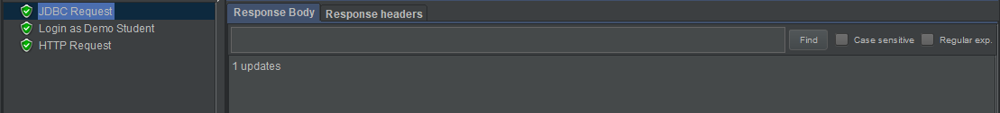
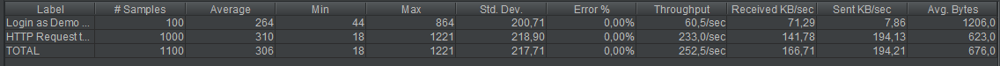
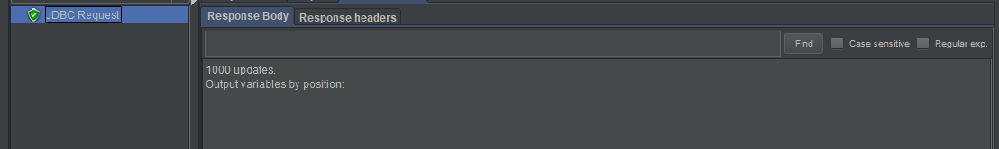
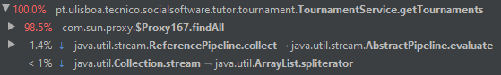
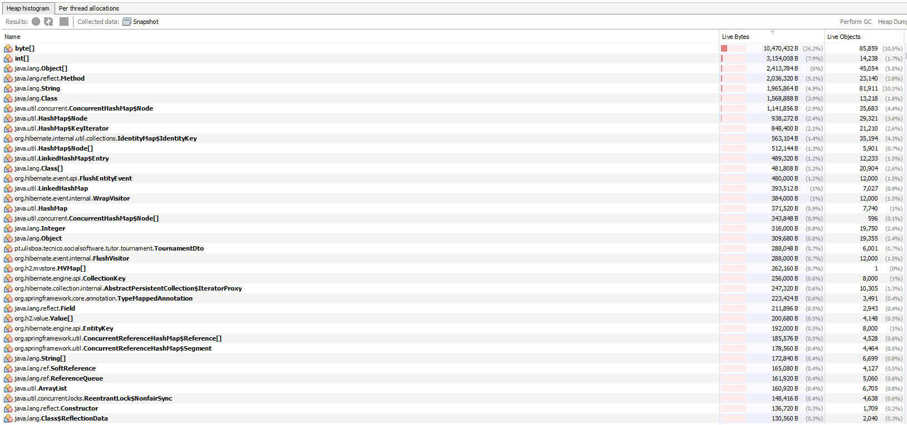

# ES20 P2 submission, Group 46

## Feature PPA

### Subgroup
 - Diogo Barata, ist90593, DiogoBarata
   + Issues assigned: [#133](https://github.com/tecnico-softeng/es20tg_46-project/issues/133), [#134](https://github.com/tecnico-softeng/es20tg_46-project/issues/134)
 - Henrique Neves, ist90609, Henrique-Neves
   + Issues assigned: [#129](https://github.com/tecnico-softeng/es20tg_46-project/issues/129), [#130](https://github.com/tecnico-softeng/es20tg_46-project/issues/130)
 
### Pull requests associated with this feature

The list of pull requests associated with this feature is:

 - [PR #171](https://github.com/tecnico-softeng/es20tg_46-project/pull/171)

### Web services definition

#### Controllers
 - [QuestionController](https://github.com/tecnico-softeng/es20tg_46-project/blob/ppa/backend/src/main/java/pt/ulisboa/tecnico/socialsoftware/tutor/question/api/QuestionController.java)
 - [TopicController](https://github.com/tecnico-softeng/es20tg_46-project/blob/ppa/backend/src/main/java/pt/ulisboa/tecnico/socialsoftware/tutor/question/api/TopicController.java)

### Feature testing

Each subgroup member defined one reading test and one writing test. The direct links to these are:

 - [ReadingTestJMeter](https://github.com/tecnico-softeng/es20tg_46-project/blob/ppa/backend/jmeter/Topic/WSGetCourseTopicsTest.jmx)
 - [ReadingTestJMeter](https://github.com/tecnico-softeng/es20tg_46-project/blob/ppa/backend/jmeter/question/WS_GetSubmittedQuestionsTest.jmx)
 
 - [WritingTestJMeter](https://github.com/tecnico-softeng/es20tg_46-project/blob/ppa/backend/jmeter/question/WS_ReviewQuestionTest.jmx)
 - [WritingTestJMeter](https://github.com/tecnico-softeng/es20tg_46-project/blob/ppa/backend/jmeter/Topic/WSCreateTopicTest.jmx)
 - [WritingTestJMeter](https://github.com/tecnico-softeng/es20tg_46-project/blob/ppa/backend/jmeter/question/WS_createQuestionTest.jmx)

#### Screenshots of Results Trees and DB cleanup

### Load testing

Each subgroup member defined one reading test and one writing test. The direct links to these are:

 - [ReadingTestJMeter](https://github.com/tecnico-softeng/es20tg_46-project/blob/ppa/backend/jmeter/question/WS_GetSubmittedQuestionsLoadTest.jmx)
 - [ReadingTestJMeter](https://github.com/tecnico-softeng/es20tg_46-project/blob/ppa/backend/jmeter/Topic/WSGetCourseTopicLoadTest.jmx)
 - [WritingTestJMeter](https://github.com/tecnico-softeng/es20tg_46-project/blob/ppa/backend/jmeter/question/WS_ReviewQuestionLoadTest.jmx)
 - [WritingTestJMeter](https://github.com/tecnico-softeng/es20tg_46-project/blob/ppa/backend/jmeter/question/WS_createQuestionLoadTest.jmx)
 - [WritingTestJMeter](https://github.com/tecnico-softeng/es20tg_46-project/blob/ppa/backend/jmeter/Topic/WSCreateTopicLoadTest.jmx)

#### Screenshots of Summary Reports and DB cleanup

### Service profiling

We used the [Async Profiler](https://www.jetbrains.com/help/idea/async-profiler.html).

#### Screenshots of summary reports

---

## Feature DDP

### Subgroup
 - Gonçalo Carreira, ist190603, Gcarreira99
   + Issues assigned: [#159](https://github.com/tecnico-softeng/es20tg_46-project/issues/159)
 - Rúben Gualdino , ist190632, RGualdino
   + Issues assigned: [#140](https://github.com/tecnico-softeng/es20tg_46-project/issues/140)
 
### Pull requests associated with this feature

The list of pull requests associated with this feature is:

 - [PR #173](https://github.com/tecnico-softeng/es20tg_46-project/pull/173)

### Web services definition

#### Controllers
 - [ClarificationController0](https://github.com/tecnico-softeng/es20tg_46-project/blob/ddp/backend/src/main/java/pt/ulisboa/tecnico/socialsoftware/tutor/clarification/ClarificationController.java)

### Feature testing

Each subgroup member defined one reading test and one writing test. The direct links to these are:

 - [WritingTestJMeter](https://github.com/tecnico-softeng/es20tg_46-project/blob/ddp/backend/jmeter/clarification/WSUpdateClarificationTest.jmx)

#### Screenshots of Results Trees and DB cleanup

### Load testing

Each subgroup member defined one reading test and one writing test. The direct links to these are:

 - [WritingTestJMeter](https://github.com/tecnico-softeng/es20tg_46-project/blob/ddp/backend/jmeter/clarification/WSCreateClarificationLoadTest.jmx)

#### Screenshots of Summary Reports and DB cleanup

### Service profiling

We used the [Async Profiler](https://github.com/tecnico-softeng/es20tg_46-project/blob/ddp/docs/p2/ProfilingGetClarification.png).

#### Screenshots of summary reports

---

## Feature TDP

### Subgroup
 - Miguel Silva, ist90624, JogaJiga
   + Issues assigned: [#1](https://github.com), [#3](https://github.com)
 - Nuno Ramos, ist90626, nmiguel
   + Issues assigned: [#2](https://github.com), [#4](https://github.com)
 
### Pull requests associated with this feature

The list of pull requests associated with this feature is:

 - [PR #138](https://github.com/tecnico-softeng/es20tg_46-project/pull/138)

### Web services definition

#### Controllers
 - [TournamentController](https://github.com/tecnico-softeng/es20tg_46-project/blob/tdp/backend/src/main/java/pt/ulisboa/tecnico/socialsoftware/tutor/tournament/TournamentController.java)

### Feature testing

Each subgroup member defined one reading test and one writing test. The direct links to these are:

 - [ReadingTestJMeter](https://github.com/tecnico-softeng/es20tg_46-project/blob/tdp/backend/jmeter/tournament/WSGetTournamentTest.jmx)
 - [WritingTestJMeter](https://github.com/tecnico-softeng/es20tg_46-project/blob/tdp/backend/jmeter/tournament/WSCreateTournamentTest.jmx)

#### Screenshots of Results Trees and DB cleanup

### Load testing

Each subgroup member defined one reading test and one writing test. The direct links to these are:

 - [ReadingTestJMeter](https://github.com/tecnico-softeng/es20tg_46-project/blob/tdp/backend/jmeter/tournament/WSGetTournamentLoadTest.jmx)
 - [WritingTestJMeter](https://github.com/tecnico-softeng/es20tg_46-project/blob/tdp/backend/jmeter/tournament/WSCreateTournamentLoadTest.jmx)

#### Screenshots of Summary Reports and DB cleanup

### Service profiling

We used the [Async Profiler](https://www.jetbrains.com/help/idea/async-profiler.html).

#### Screenshots of summary reports

