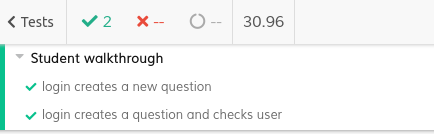
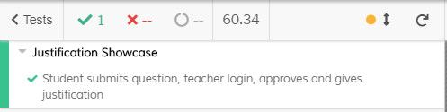
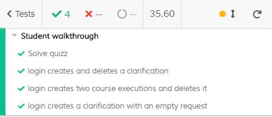
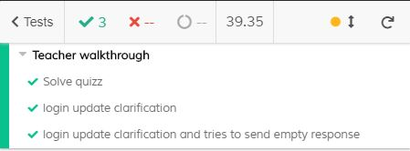

# ES20 P3 submission, Group 46

## Feature PPA

### Subgroup
 - Diogo Barata, ist90593, DiogoBarata
   + Issues assigned: [#187](https://github.com/tecnico-softeng/es20tg_46-project/issues/187), 
   [#188](https://github.com/tecnico-softeng/es20tg_46-project/issues/188),
   [#189](https://github.com/tecnico-softeng/es20tg_46-project/issues/189)
 - Henrique Neves, ist90609, Henrique-Neves
   + Issues assigned: [#184](https://github.com/tecnico-softeng/es20tg_46-project/issues/184), 
   [#185](https://github.com/tecnico-softeng/es20tg_46-project/issues/185),
   [#186](https://github.com/tecnico-softeng/es20tg_46-project/issues/186)
 
### Pull requests associated with this feature

The list of pull requests associated with this feature is:

 - [PR #211](https://github.com/tecnico-softeng/es20tg_46-project/pull/211)

### Frontend

#### New/Updated Views

 - [QuestionsStudentsView](https://github.com/tecnico-softeng/es20tg_46-project/blob/ppa/frontend/src/views/student/questionsStudents/QuestionsStudentsView.vue)
 - [QuestionsView](https://github.com/tecnico-softeng/es20tg_46-project/blob/ppa/frontend/src/views/teacher/questions/QuestionsView.vue)

#### New/Updated Models

 - [Question.ts](https://github.com/tecnico-softeng/es20tg_46-project/blob/ppa/frontend/src/models/management/Question.ts)

### Additional services implemented

 - No new service implemented
 
### End-to-end tests

#### Created tests

 - [Login creates a question](https://github.com/tecnico-softeng/es20tg_46-project/blob/ppa/frontend/cypress/integration/student/manageQuestions.js)
 - [Login creates a question and checks user](https://github.com/tecnico-softeng/es20tg_46-project/blob/ppa/frontend/cypress/integration/student/manageQuestions.js)
 - [Student submits question, teacher login, approves and gives justification](https://github.com/tecnico-softeng/es20tg_46-project/blob/ppa/frontend/cypress/integration/justification/justification.js)

#### Rationale
In our point of view end-to-end tests are very important because they replicate the user´s behavior on the application that we are testing so we can assure that every thing is working correctly from the data base and back-end all the way to the front-end.
 

#### Commands defined

 - [commands.js](https://github.com/tecnico-softeng/es20tg_46-project/blob/ppa/frontend/cypress/support/commands.js)

#### Screenshot of test results overview

---

## Feature DDP

### Subgroup

 - Gonçalo Carreira, ist190603, Gcarreira99
   + Issues assigned: [#200](https://github.com/tecnico-softeng/es20tg_46-project/issues/200), [#201](https://github.com/tecnico-softeng/es20tg_46-project/issues/201)
 - Rúben Gualdino , ist190632, RGualdino
   + Issues assigned: [#202](https://github.com/tecnico-softeng/es20tg_46-project/issues/202), [#203](https://github.com/tecnico-softeng/es20tg_46-project/issues/203)
 
### Pull requests associated with this feature

The list of pull requests associated with this feature is:

 - [PR #207](https://github.com/tecnico-softeng/es20tg_46-project/pull/207)

### Frontend

#### New/Updated Views

 - [ClarificationsTeacherView](https://github.com/tecnico-softeng/es20tg_46-project/blob/ddp/frontend/src/views/teacher/clarifications/ClarificationsTeacherView.vue)
 - [EditClarificationTeacherClarification](https://github.com/tecnico-softeng/es20tg_46-project/blob/ddp/frontend/src/views/teacher/clarifications/EditClarificationTeacherClarification.vue)
 - [ClarificationsView](https://github.com/tecnico-softeng/es20tg_46-project/blob/ddp/frontend/src/views/student/ClarificationsView.vue)
 - [ShowClarificationDialog](https://github.com/tecnico-softeng/es20tg_46-project/blob/ddp/frontend/src/views/student/ShowClarificationDialog.vue)

#### New/Updated Models

 - [Clarification.ts]( https://github.com/tecnico-softeng/es20tg_46-project/blob/ddp/frontend/src/models/management/Clarification.ts)
 - [StatementAnswer.ts](https://github.com/tecnico-softeng/es20tg_46-project/blob/ddp/frontend/src/models/statement/StatementAnswer.ts)

### Additional services implemented

 - [ClarificationService]( https://github.com/tecnico-softeng/es20tg_46-project/blob/ddp/backend/src/main/java/pt/ulisboa/tecnico/socialsoftware/tutor/clarification/ClarificationService.java)
    + [ClarificationController](https://github.com/tecnico-softeng/es20tg_46-project/blob/ddp/backend/src/main/java/pt/ulisboa/tecnico/socialsoftware/tutor/clarification/ClarificationController.java)

### End-to-end tests

#### Created tests

 - [login creates and deletes a clarification](https://github.com/tecnico-softeng/es20tg_46-project/blob/ddp/frontend/cypress/integration/student/createClarifications.js#L14)
 - [login creates two course executions and deletes it](https://github.com/tecnico-softeng/es20tg_46-project/blob/ddp/frontend/cypress/integration/student/createClarifications.js#L20)
 - [login creates a clarification with an empty request](https://github.com/tecnico-softeng/es20tg_46-project/blob/ddp/frontend/cypress/integration/student/createClarifications.js#L34)
 - [login update clarification](https://github.com/tecnico-softeng/es20tg_46-project/blob/ddp/frontend/cypress/integration/student/createClarifications.js#L17)
 - [login update clarification and tries to send empty response](https://github.com/tecnico-softeng/es20tg_46-project/blob/ddp/frontend/cypress/integration/student/createClarifications.js#L24)

#### Rationale
By implementing the tests we come to the conclusion that the end-to-end tests ensure that all integrated pieces works as they are supposed to do. 
Also we could say that is a more effective way to see how the website works in the simulated "real life conditions".

#### Commands defined

  - [updateClarification](https://github.com/socialsoftware/quizzes-tutor/blob/master/frontend/tests/e2e/support/commands.js#46)
  - [updateClarificationWithoutWrite](https://github.com/socialsoftware/quizzes-tutor/blob/master/frontend/tests/e2e/support/commands.js#58)
  - [closeErrorMessageTeacher](https://github.com/socialsoftware/quizzes-tutor/blob/master/frontend/tests/e2e/support/commands.js#69)
  - [createClarification](https://github.com/socialsoftware/quizzes-tutor/blob/master/frontend/tests/e2e/support/commands.js#141)
  - [createClarificationWithoutRequest](https://github.com/socialsoftware/quizzes-tutor/blob/master/frontend/tests/e2e/support/commands.js#150)
  - [deleteClarification](https://github.com/socialsoftware/quizzes-tutor/blob/master/frontend/tests/e2e/support/commands.js#158)
  - [createErrorMessage](https://github.com/socialsoftware/quizzes-tutor/blob/master/frontend/tests/e2e/support/commands.js#170)
  - [createSolvedQuiz](https://github.com/socialsoftware/quizzes-tutor/blob/master/frontend/tests/e2e/support/commands.js#177)

#### Screenshot of test results overview

---

## Feature TDP

### Subgroup

 - Miguel Silva, ist90624, JogaJiga
   + Issues assigned: [#1](https://github.com/tecnico-softeng/es20tg_46-project/issues/177)
 - Nuno Ramos, ist90626, nmiguel
   + Issues assigned: [#2](https://github.com/tecnico-softeng/es20tg_46-project/issues/198), [#4](https://github.com/tecnico-softeng/es20tg_46-project/issues/205)
 
### Pull requests associated with this feature

The list of pull requests associated with this feature is:

 - [PR #206](https://github.com/tecnico-softeng/es20tg_46-project/pull/206)

### Frontend

#### New/Updated Views

 - [CreateTournamentView](https://github.com/tecnico-softeng/es20tg_46-project/blob/tdp/frontend/src/views/student/CreateTournamentView.vue)
 - [AvailableTournamentsView](https://github.com/tecnico-softeng/es20tg_46-project/blob/tdp/frontend/src/views/student/AvailableTournamentsView.vue)

#### New/Updated Models

 - [Tournament](https://github.com/tecnico-softeng/es20tg_46-project/blob/tdp/frontend/src/models/tournament/Tournament.ts)
 - [User](https://github.com/tecnico-softeng/es20tg_46-project/blob/tdp/frontend/src/models/user/User.ts)

### End-to-end tests

#### Created tests

 - [Login creates a tournament](https://github.com/tecnico-softeng/es20tg_46-project/blob/tdp/frontend/cypress/integration/tournament/manageTournament.js#L12)

#### Rationale
In our point of view end-to-end tests are very important because they replicate the user´s behavior on the application that we are testing so we can assure that every thing is working correctly from the data base and back-end all the way to the front-end.
This allow us, programmers, trough tools like cypress automate end-to-end tests and having this well-written can save us hours of development time and can prevent bugs and unexpected behaviors before entering the production phase.

#### Commands defined

 - [createTournament](https://github.com/socialsoftware/quizzes-tutor/blob/master/frontend/tests/e2e/support/commands.js#L84)

#### Screenshot of test results overview

