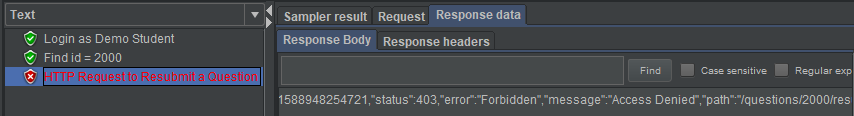
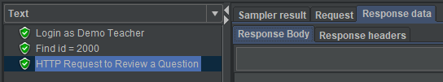
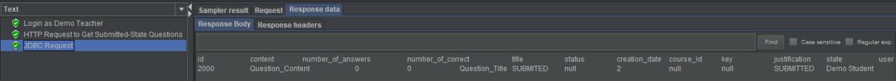
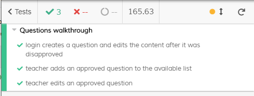

# ES20 P4 submission, Group 46

## Feature PPA

### Subgroup

 - Diogo Barata, ist90593, DiogoBarata
   + Issues assigned: [#248](https://github.com/tecnico-softeng/es20tg_46-project/issues/248), [#264](https://github.com/tecnico-softeng/es20tg_46-project/issues/264), [#265](https://github.com/tecnico-softeng/es20tg_46-project/issues/265)
   + Tasks: F4, F5, F7, F2
 - Henrique Neves, ist90609, Henrique-Neves
   + Issues assigned: [#252](https://github.com/tecnico-softeng/es20tg_46-project/issues/252), [#251](https://github.com/tecnico-softeng/es20tg_46-project/issues/251)
   [#241](https://github.com/tecnico-softeng/es20tg_46-project/issues/241), [#249](https://github.com/tecnico-softeng/es20tg_46-project/issues/249)
   + Tasks: F4, F5, F6
 
### Pull requests associated with this feature

The list of pull requests associated with this feature is:

 - [PR #295](https://github.com/tecnico-softeng/es20tg_46-project/pull/295)
 

### Listed features

Below, we list **only** the implemented features. For each feature, we link the relevant files and we mark which are requested parts are completed.

#### Feature number 1: _Uma questão aprovada pode passar a fazer parte do conjunto de perguntas disponíveis_

 - [x] Service - Done last submission
 - [x] Spock tests - Done last submission
 - [x] JMeter feature tests - Done last submission
 
   
 - [x] [Cypress use case test](https://github.com/tecnico-softeng/es20tg_46-project/blob/ppa/frontend/cypress/integration/questions/manageQuestions.js)
   
   
    
#### Feature number 2: Uma questão aprovada pode ser editada antes de ficar available

 - [x] [Service](https://github.com/tecnico-softeng/es20tg_46-project/blob/ppa/backend/src/main/java/pt/ulisboa/tecnico/socialsoftware/tutor/question/QuestionService.java)
 - [x] [Spock tests](https://github.com/tecnico-softeng/es20tg_46-project/tree/ppa/backend/src/test/groovy/pt/ulisboa/tecnico/socialsoftware/tutor/question/service)
 - [ ] [JMeter feature test](https://github.com)
 - [x] [Cypress use case test](https://github.com/tecnico-softeng/es20tg_46-project/blob/ppa/frontend/cypress/integration/questions/manageQuestions.js)

#### Feature number 3: Uma questão pode ser resubmetida pelo aluno depois de ser rejeitada

 - [x] [Service](https://github.com/tecnico-softeng/es20tg_46-project/blob/ppa/backend/src/main/java/pt/ulisboa/tecnico/socialsoftware/tutor/question/QuestionService.java)
 - [x] [Spock tests](https://github.com/tecnico-softeng/es20tg_46-project/tree/ppa/backend/src/test/groovy/pt/ulisboa/tecnico/socialsoftware/tutor/question/service)
 - [x] [JMeter feature test](https://github.com/tecnico-softeng/es20tg_46-project/blob/ppa/backend/jmeter/question/WS_ResubmitQuestionTest.jmx)
 
 
 
 - [x] [Cypress use case test](https://github.com/tecnico-softeng/es20tg_46-project/blob/ppa/frontend/cypress/integration/questions/manageQuestions.js)

#### Feature number 4: Update das entregas passadas

   - [x] [Service](https://github.com/tecnico-softeng/es20tg_46-project/blob/ppa/backend/src/main/java/pt/ulisboa/tecnico/socialsoftware/tutor/question/QuestionService.java)
  - [x] [Spock tests](https://github.com/tecnico-softeng/es20tg_46-project/tree/ppa/backend/src/test/groovy/pt/ulisboa/tecnico/socialsoftware/tutor/impexp/service)
  - [x] [JMeter feature test](https://github.com/tecnico-softeng/es20tg_46-project/tree/ppa/backend/jmeter/question)
 - [x] [Cypress use case test](https://github.com/tecnico-softeng/es20tg_46-project/blob/ppa/frontend/cypress/integration/questions/manageQuestions.js)
 
Cypress and Jmeter Test Results for previous features 

 

Cypress Test Results for features number 1, 2, 3 and 4 (Previous test were merged with the new ones):

#### Feature number 5: Dashboard

 - [x] [Service](https://github.com/tecnico-softeng/es20tg_46-project/blob/ppa/backend/src/main/java/pt/ulisboa/tecnico/socialsoftware/tutor/question/QuestionService.java)
 - [ ] [Spock tests](https://github.com/tecnico-softeng/es20tg_46-project/tree/ppa/backend/src/test/groovy/pt/ulisboa/tecnico/socialsoftware/tutor/question/service)
 - [ ] [JMeter feature test](https://github.com)
 - [ ] [Cypress use case test](https://github.com/tecnico-softeng/es20tg_46-project/blob/ppa/frontend/cypress/integration/questions/manageQuestions.js)

---

## Feature DDP

### Subgroup

 - Gonçalo Carreira, ist190603, Gcarreira99
   + Issues assigned: [#279](https://github.com/tecnico-softeng/es20tg_46-project/issues/279), [#289](https://github.com/tecnico-softeng/es20tg_46-project/issues/289)
   + Tasks: F2, F3
 - Rúben Gualdino, ist190632, RGualdino
   + Issues assigned: [#278](https://github.com/tecnico-softeng/es20tg_46-project/issues/278), [#287](https://github.com/tecnico-softeng/es20tg_46-project/issues/287)
   + Tasks: F1, F4
 
### Pull requests associated with this feature

The list of pull requests associated with this feature is:

 - [PR #282](https://github.com/tecnico-softeng/es20tg_46-project/pull/282)

### Listed features

On the fourth feature was implemented the frontend part even without jmeter and cypress tests. In that feature was used a certain service but not edited.

#### Feature number 1: _O aluno pode pedir esclarecimentos adicionais_

 - [x] [Service](https://github.com/tecnico-softeng/es20tg_46-project/blob/ddp/backend/src/main/java/pt/ulisboa/tecnico/socialsoftware/tutor/clarification/ClarificationService.java)
 - [x] [Spock tests](https://github.com/tecnico-softeng/es20tg_46-project/blob/ddp/backend/src/test/groovy/pt/ulisboa/tecnico/socialsoftware/tutor/clarification/service/AdditionalClarificationRequest.groovy)
 - [ ] [JMeter feature tests](https://github.com)
 - [x] [Cypress use case test](https://github.com/tecnico-softeng/es20tg_46-project/blob/ddp/frontend/cypress/integration/student/addAdditionalClarification.js)
   + Screenshot: 
   
     

#### Feature number 2: _O docente esclarece o aluno acerca da pergunta_
 - [x] [Service](https://github.com/tecnico-softeng/es20tg_46-project/blob/ddp/backend/src/main/java/pt/ulisboa/tecnico/socialsoftware/tutor/clarification/ClarificationService.java)
 - [x] [Spock tests](https://github.com/tecnico-softeng/es20tg_46-project/blob/ddp/backend/src/test/groovy/pt/ulisboa/tecnico/socialsoftware/tutor/clarification/service/ClarificationPrivacyTest.groovy)
 - [ ] [JMeter feature tests](https://github.com)
 - [x] [Cypress use case test](https://github.com/tecnico-softeng/es20tg_46-project/blob/ddp/frontend/cypress/integration/teacher/privacyTeacherClarification.js)
   + Screenshot: 
   
     
     
#### Feature number 3: _O aluno visualiza a resposta do docente, ou o estado de todas as suas perguntas_
 - [x] [Service](https://github.com/tecnico-softeng/es20tg_46-project/blob/ddp/backend/src/main/java/pt/ulisboa/tecnico/socialsoftware/tutor/clarification/ClarificationService.java)
 - [x] [Spock tests](https://github.com/tecnico-softeng/es20tg_46-project/blob/ddp/backend/src/test/groovy/pt/ulisboa/tecnico/socialsoftware/tutor/clarification/service/GetClarificationsByQuestionTest.groovy)
 - [ ] [JMeter feature tests](https://github.com)
 - [x] [Cypress use case test](https://github.com/tecnico-softeng/es20tg_46-project/blob/ddp/frontend/cypress/integration/student/publicClarificationByQuestion.js)
   + Screenshot: 
   
     

#### Feature number 4: _dashboard do aluno onde é apresentada informação (acerca do DDP) e O aluno decide se esta informação no seu dashboard deve ser pública ou privada_
 - [x] [Service](https://github.com/tecnico-softeng/es20tg_46-project/blob/ddp/backend/src/main/java/pt/ulisboa/tecnico/socialsoftware/tutor/statistics/StatsController.java)
 - [ ] [Spock tests](https://github.com/tecnico-softeng/es20tg_46-project/blob/ddp/backend/src/test/groovy/pt/ulisboa/tecnico/socialsoftware/tutor/clarification/service/GetClarificationsByQuestionTest.groovy)
 - [ ] [JMeter feature tests](https://github.com)
 - [ ] [Cypress use case test](https://github.com/tecnico-softeng/es20tg_46-project/blob/ddp/frontend/cypress/integration/student/publicClarificationByQuestion.js)

---

## Feature TDP

### Subgroup

 - Miguel Silva, ist90624, JogaJiga
   + Issues assigned: [#1](https://github.com/tecnico-softeng/es20tg_46-project/issues/230), [#3](https://github.com/tecnico-softeng/es20tg_46-project/issues/), [#5](https://github.com/tecnico-softeng/es20tg_46-project/issues/246)
   + Tasks: F5, F6
 - Nuno Ramos, ist90626, nmiguel
   + Issues assigned: [#2](https://github.com/tecnico-softeng/es20tg_46-project/issues/221), [#4](https://github.com/tecnico-softeng/es20tg_46-project/issues/219), [#6](https://github.com/tecnico-softeng/es20tg_46-project/issues/215), [#7](https://github.com/tecnico-softeng/es20tg_46-project/issues/216), [#8](https://github.com/tecnico-softeng/es20tg_46-project/issues/214)
   + Tasks: F3, F4
 
### Pull requests associated with this feature

The list of pull requests associated with this feature is:

 - [PR #247](https://github.com/tecnico-softeng/es20tg_46-project/pull/247)

### Listed features

#### Feature number 1: Se o número de alunos inscritos, incluindo o criador do torneio, for superior a 1, o sistema gera o quiz associado ao torneio

 - [x] [Service](https://github.com/tecnico-softeng/es20tg_46-project/blob/tdp/backend/src/main/java/pt/ulisboa/tecnico/socialsoftware/tutor/tournament/TournamentService.java)

#### Feature number 2: O aluno que criou o torneio pode cancelá-lo

 - [x] [Service](https://github.com/tecnico-softeng/es20tg_46-project/blob/tdp/backend/src/main/java/pt/ulisboa/tecnico/socialsoftware/tutor/tournament/TournamentService.java)

#### Feature number 3: Os alunos participantes respondem às perguntas no período definido para o torneio

 - [x] [Service](https://github.com/tecnico-softeng/es20tg_46-project/blob/tdp/backend/src/main/java/pt/ulisboa/tecnico/socialsoftware/tutor/tournament/TournamentService.java)

### Additional features

#### Feature number 4: O sistema verifica no momento de criação de um torneio se o tópico existe e contem perguntas suficientes para criar o quizz desejado

 - [x] [Service](https://github.com/tecnico-softeng/es20tg_46-project/blob/tdp/backend/src/main/java/pt/ulisboa/tecnico/socialsoftware/tutor/tournament/TournamentService.java)

---
